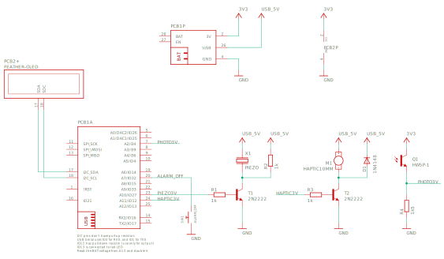

# CALalarm

[](https://github.com/cvonk/CALalarm/discussions)


## There is no better feeling than not having to set an alarm


Picture is from old ESP8266 based version.

Features:

  - [x] Shows the time and first event of the day.
  - [x] Piezo and haptic to wake you up
  - [x] Button stops the alarm
  - [x] Supports over-the-air updates [^1]
  - [x] Easily one-time provisioning from an Android phone [^1]
  - [x] Integrates with MQTT
  - [x] Open source!

## Software

Clone the repository and its submodules to a local directory. The `--recursive` flag automatically initializes and updates the submodules in the repository.  Start with a fresh clone:

```bash
git clone --recursive https://github.com/cvonk/CALalarm.git
```

### Google Apps Script

The software is a symbiosis between [Google Apps Script](https://developers.google.com/apps-script/guides/web) and firmware running on the ESP32. The script reads the alarm event from your Google Calendar and presents it as JSON to the ESP32 device.

To create the Web app:
  - Create a new project on [script.google.com](https://script.google.com);
  - Rename the project to e.g. `CALalarm-doGet`
  - Copy and paste the code from `script\Code.js`
  - Add the `Google Calendar API` service .
  - Select the function `test` and click `Debug`. This will ask for permissions. There will not be any output.
  - Click `Deploy` and chose `New deployment`, choose
    - Service tye = `Web app`
    - Execute as = `Me`
    - Who has access = `Anyone`, make sure you understand what the script does!
    - Copy the Web app URL to the clipboard

Open the URL in a web browser. You should get a reply like
```json
{
    "time": "2022-04-20 12:56:37",
    "pushId": "some_id_or_not",
    "events": [
        { 
            "start": "2022-04-20 10:30:00",
            "end": "2022-04-20 15:45:00",
            "title": "School"
        },
    ]
}
```

Now, copy the `alarm/main/Kconfig.example` to `alarm/main/Kconfig` and paste the URL that ends in `/exec` to `alarm/main/Kconfig` under `CALALARM_GAS_CALENDAR_URL`.

As we see in the next sections, the ESP32 does a `HTTP GET` on this URL. That way it retrieves a list of upcoming events from your calendar, and update the OLED display accordingly.


### ESP32 Device

In `menuconfig`, scroll down to CALalarm and select "Use hardcoded Wi-Fi credentials" and specify the SSID and password of your Wi-Fi access point.

```bash
git clone https://github.com/cvonk/CALalarm.git
cd CALalarm/clock
idf.py set-target esp32
idf.py menuconfig
idf.py flash
```

## Hardware

> :warning: **THIS PROJECT IS OFFERED AS IS. IF YOU USE IT YOU ASSUME ALL RISKS. NO WARRENTIES.**

### Schematic




### Bill of materials

| Name          | Description                                             | Sugggested mfr/part#       |
|---------------|---------------------------------------------------------|----------------------------|
| FEATHER-ESP32 | HUZZAH32 ESP32 Feather, stack hdr (ESP-WROOM-32 16MB)   | [Adafruit 3619](https://www.digikey.com/en/products/detail/adafruit-industries-llc/3619/8119806?s=N4IgTCBcDaIIIBMCGAzATgVwJYBcAEAzAGwCMAnCALoC%2BQA)
| FEATHER-OLED  | FeatherWing OLED - 128X32                               | [Adafruit 2900](https://www.digikey.com/en/products/detail/adafruit-industries-llc/2900/5810890?s=N4IgTCBcDaIIIBMCGAzATgVwJYBcAEYAnAAzEgC6AvkA)
| PROTO         | FeatherWing Prototyping Add-on                          | [Adafruit 2884](https://www.digikey.com/en/products/detail/adafruit-industries-llc/2884/5777193?s=N4IgTCBcDaIIIBMCGAzATgVwJYBcAEYAHIQCwgC6AvkA)
| M1            | Vibrating mini motor disc, 5V                           | [Adafruit 1201](https://www.digikey.com/en/products/detail/adafruit-industries-llc/1201/5353637?s=N4IgTCBcDaIIIBMCGAzATgVwJYBcAEAjGAAwEgC6AvkA)
| X1            | Buzzer 5V, DC, breadboard friendly                      | [Adafruit 1536](https://www.adafruit.com/product/1536) or [TDK PS1420P02CT](https://www.digikey.com/en/products/detail/tdk-corporation/PS1420P02CT/935931)
| Q1            | Photo Transistor, HW5P-1                                | [Adafruit 2831](https://www.digikey.com/en/products/detail/adafruit-industries-llc/2831/8323990?s=N4IgTCBcDaIIIBMCGAzATgVwJYBcAEYAHAMwCMIAugL5A)
| R1, R2, R3    | Resistor, 1 k&Ohm;, 1/4 W, axial                        | [Yageo CFR-25JT-52-1K](https://www.digikey.com/en/products/detail/yageo/CFR-25JT-52-1K/13921014)
| R4            | Resistor, 1.5 k&Ohm; 1/4 W, axial                       | [Yageo CFR-25JB-52-1K5](https://www.digikey.com/en/products/detail/yageo/CFR-25JB-52-1K5/132)]
| T1, T2        | NPN transistor, 40V / 600mA, TO92-3                     | [NTE Electronics PN2222A](https://www.digikey.com/en/products/detail/nte-electronics-inc/PN2222A/11655004)
| D1            | Diode, gen purp, 100V / 200MA, DO35                     | [onsemi 1N4148](https://www.digikey.com/en/products/detail/onsemi/1N4148/458603)


## Feedback

I love to hear from you. Please use the Github discussions to provide feedback.
